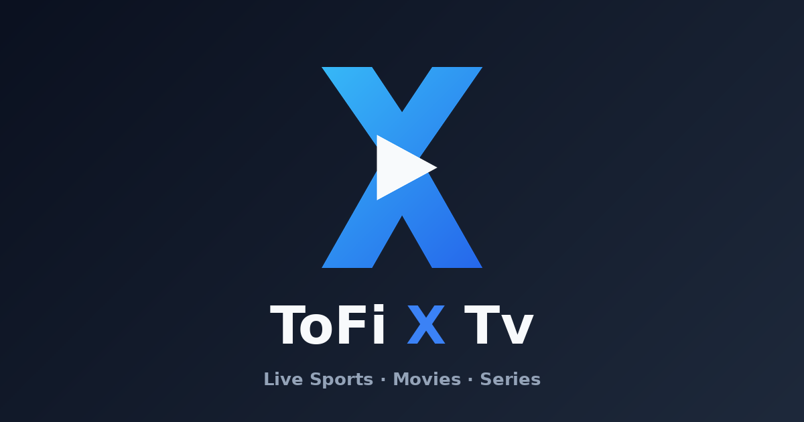

<div dir="rtl">

# توفي إكس تيفي — ToFi X Tv

منصة عربية/إنجليزية موحّدة بهوية 2026: مباريات بث مباشر، مركز مباريات تفصيلي، ترتيب، هدافون، أخبار — بالإضافة إلى قسم كامل للأفلام والمسلسلات. بدون قاعدة بيانات وبدون أي إطار عمل خارجي.

</div>

**ToFi X Tv** is a bilingual (Arabic-first) sports + streaming platform: live scores,
a full match center, standings, top scorers, news, plus a complete movies & series section (TMDB-powered), PWA and push notifications —
zero database, zero framework dependencies, deployable on any PHP host.



## Highlights

- **Original 2026 design system** — glassmorphism, liquid UI, dark/light modes,
  RTL-first with full LTR support, custom logo/icon set (SVG sources included).
- **Clean URLs everywhere** — no `.php`, no query-string routing, automatic
  301s from every legacy URL, canonical + hreflang on every page.
- **Bilingual** — `/` Arabic ↔ `/en` English with automatic API source
  switching (`api-ar` / `api-en`).
- **12-hour time system** — `08:00 م` / `08:00 PM` everywhere, corrected to the
  visitor's timezone client-side.
- **First-party media proxy** — `/media/teams/64/x.png` with disk caching,
  on-the-fly WebP, immutable headers; the upstream CDN never appears.
- **Match center** — timeline (goals, cards, VAR-cancelled goals, pens, subs),
  lineups with ratings, 20+ stat comparisons, channels & commentators,
  standings, scorers, league news, countdown, live auto-refresh.
- **SEO** — SportsEvent / NewsArticle / Organization / WebSite / BreadcrumbList
  JSON-LD, OG + Twitter cards, XML + Google News sitemaps, robots.txt.
- **PWA** — installable, offline fallback, app shortcuts, FCM push
  (goal / kick-off / HT / FT / breaking news via cron worker).
- **Admin panel** (`/admin`) — logo manager, SEO manager, homepage builder,
  theme settings, cache manager, notification manager, newsletter export,
  analytics dashboard.

## Structure

```
public/          document root (front controller, assets, PWA, brand kit)
app/             config, router, controllers, views, i18n, core services
storage/         disk cache (api, media) + JSON settings   [writable]
deploy/          nginx.conf, dev router, notification cron worker, DEPLOYMENT.md
database/        optional MySQL schema (schema.sql)
docs/            API architecture (docs/API.md)
```

## Quick start

```bash
php -S 0.0.0.0:8080 -t public deploy/dev-router.php
# → http://localhost:8080  (ar)   http://localhost:8080/en  (en)
# → http://localhost:8080/admin   (password: see app/config.php — change it!)
```

Production setup, cron jobs, FCM and CDN: **[deploy/DEPLOYMENT.md](deploy/DEPLOYMENT.md)**.
Data flow and endpoint map: **[docs/API.md](docs/API.md)**.

## URL map

`/` · `/matches` · `/matches/2026-07-02` · `/today` · `/tomorrow` · `/yesterday` · `/live`
`/match/{slug}-{id}` · `/leagues` · `/league/{slug}-{id}` · `/teams` · `/team/{slug}-{id}`
`/players` · `/player/{slug}-{id}` · `/news` · `/news/page/{n}` · `/news/{slug}-{id}`
`/standings` · `/top-scorers` · `/search?q=` · `/favorites` · `/sitemap.xml` · `/media/*` · `/admin`

English: same map under `/en/…`. Arabic slugs are native (`/news/الهلال-يتأهل-...-123`).
